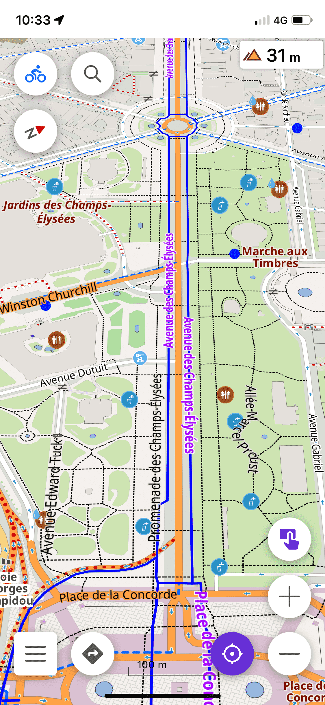
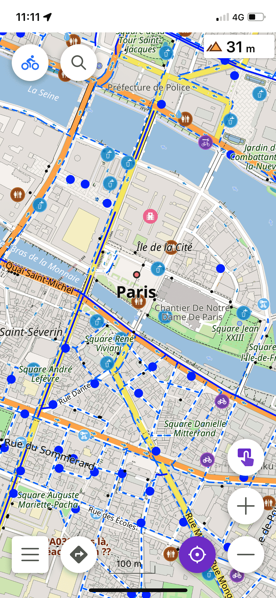
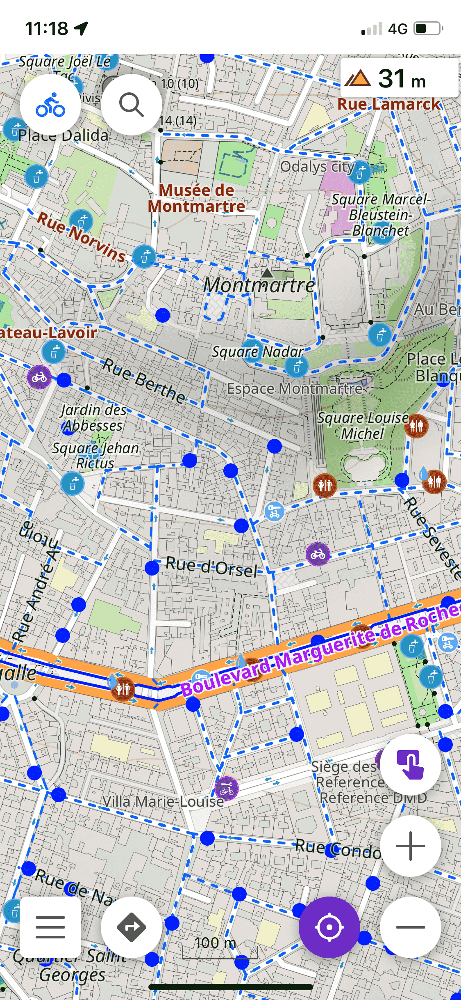
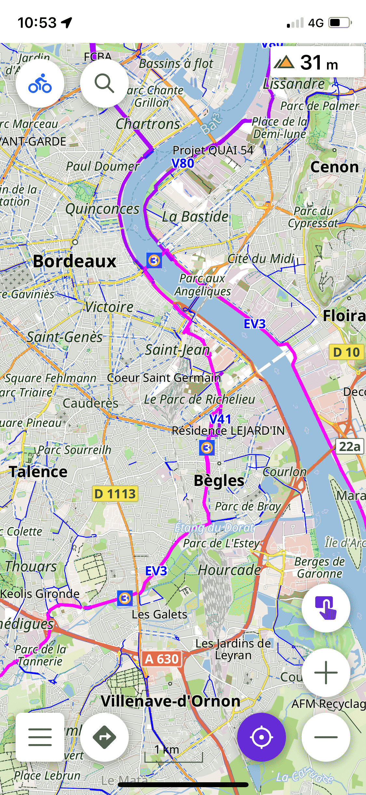
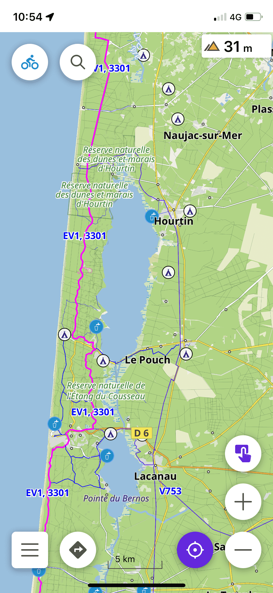
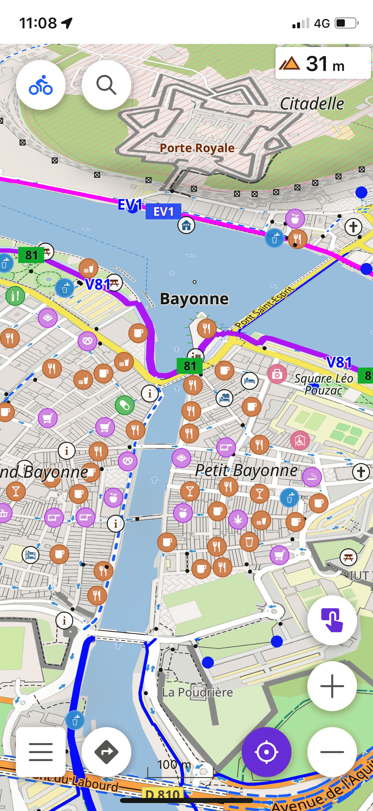

# OsmAnd_Cycling_Map
OsmAnd render  for cycling

| 🇫🇷 [Français](README.md)|🇪🇸 [Español](README_ES.md)|🇬🇧 [English](README_EN.md)|
|:---:|:---:|:---:|

# Changements notables par rapport aux styles standard :
 

- Pistes cyclables plus lisibles et visibles.
- POI utiles / intéressants mis en évidence
- Couleur des terres et utilisations de l'eau
- Couleur opaque pour les itinéraires
- Réglage supplémentaire pour le cyclotourisme
- Paramètre supplémentaire pour masquer les logos d'utilisation des terres
- Encore plus ; )
  
---

## Screenshot

| **Mode vélo** |||
| :-------------: | :-------------: | :-------------: |
|  |  |  |

| **Mode CycloTourisme** |||
| :-------------: | :-------------: | :-------------: |
|  |  |  |

## Installer le rendu
Applicable sur Android et iOS.

- Télécharger le fichier [CycloRoute.render.xml](https://raw.githubusercontent.com/Hades1503/OsmAnd_Cycling_Map/main/CycloRoute.render.xml)
  - **Depuis un ordinateur** : Faites un clic droit sur [ce lien](https://github.com/Hades1503/OsmAnd_Cycling_Map/raw/main/CycloRoute.render.xml) → <kbd><samp>Enregistrer la cible du lien sous...</samp></kbd>.
  - **Depuis un smartphone** : Faites un appui long sur [ce lien](https://github.com/Hades1503/OsmAnd_Cycling_Map/raw/main/CycloRoute.render.xml) → <kbd><samp>Télécharger la cible du lien</samp></kbd>. 
     
    *Tutoriel réalisé sous le navigateur <a href="https://www.mozilla.org/fr/firefox/new/">Firefox</a> – les termes utilisés peuvent être différents avec un autre.* 
     

| Android | iOS |
|-----------------------------------------------------------|-----------------------------------------------------------|
|   1 - À l'aide d'un gestionnaire de fichiers, `déplacez le fichier xml téléchargé` dans le dossier: `Android / data / net.osmand.plus / files / rendering` 2 -  `Fermez l'application` Osmand avec le bouton carré d'android- Ouvrez OsmAnd, puis dans le menu latéral gauche, sélectionnez `Paramétrer la carte` 3 - Descendez à `Style de la carte`  4 - Sélectionnez `CycloRoute`, votre nouveau rendu. 5 - Terminé ! 🎉 |1 - Ouvrez votre téléchargement, puis choisissez `Ouvrir avec OsmAnd`. Votre style a été importé! 2 - Ouvrez OsmAnd, puis dans le menu latéral gauche, sélectionnez sur `Paramétrer la carte` 3 - Descendez à `Style de la carte` 4 - Sélectionnez `CycloRoute`, votre nouveau rendu. 5 - Terminé ! 🎉 | 

   

## Configurer la carte pour le vélo
 

### Pour tirer le meilleur parti de ce rendu pour le CYCLISME, veuillez procéder comme expliqué ci-dessous :

   - Aller au réglage de la carte
     - Appuyez sur "Masquer"
       - Masquer les étiquettes POI
       - Masquer les icônes POI

*L'écran n'affichera que les POI utiles pour le cyclisme*
   

## Configurer la carte pour le cyclotourisme
 

### Pour tirer le meilleur parti de ce rendu pour le CYCLOTOURISME, veuillez procéder comme expliqué ci-dessous :

   - Aller au réglage de la carte
     - Appuyez sur "Masquer"
       - Masquer les étiquettes POI
       - Masquer les icônes POI

**puis**

   - Aller au réglage de la carte
     - Appuyez sur "Détails"
       - activer POI pour Cyclotourisme

*L'écran n'affichera que les POI utiles pour le Cyclotourisme en plus de ceux pour le vélo.*
