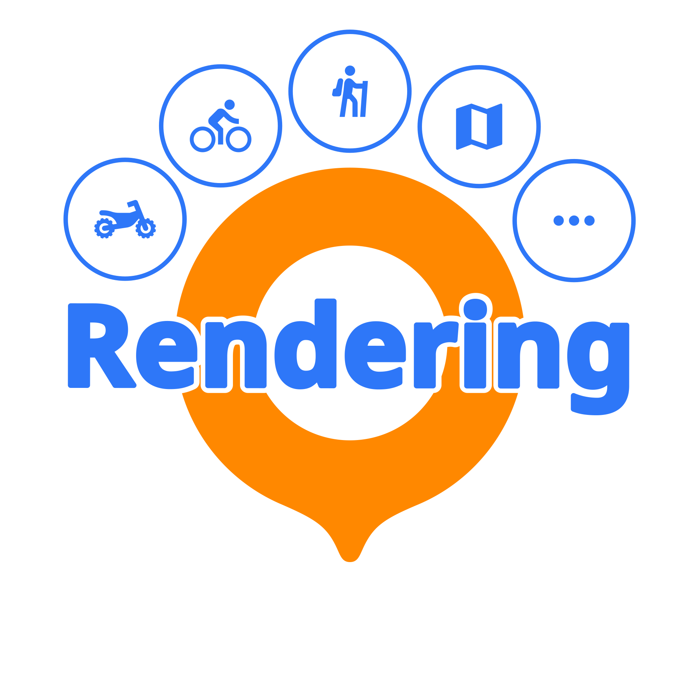

 
<a href="https://osmand-rendering.github.io/index_ES.html">Inicio</a>&emsp;

  

  
<code>Español</code>&emsp;
<a href="README_EN.md">English</a>&emsp;
<a href="README.md">Français</a>&emsp;

 

# CycloRoute

Un estilo de mapa para OsmAnd, enfocado en la práctica de la bici y del cicloturismo 
*(Última actualización 10/05/2024)*  

##  Características del estilo
 

- Inspirado en [CyclOSM](https://www.cyclosm.org/) :

     - Carriles bici más legibles y visibles
     - Puntos de interés útiles/interesantes resaltados
     - Color opaco para rutas  

- Inspirado en [Mapy.cz](https://en.mapy.cz/) :
     - Color tierra y agua  

- Configuración adicional:
     - PDI para cicloturismo
     - Para ocultar logos de uso de suelo  
- Todavía más ; )
  

---
##  Screenshots 
### Bici
|  |  |  |
| :-------------: | :-------------: | :-------------: |

### Cicloturismo
|  |  |  |
| :-------------: | :-------------: | :-------------: |
---

##  Instrucciones de instalación
 

- [Instrucciones de instalación para todos los perfiles, renderizados y enrutamiento](https://github.com/OsmAnd-Rendering/.github/wiki/ES%E2%80%94Descargar-e-Instalar)
  

---

##  Documentation
 

- [Leyenda](https://www.cyclosm.org/legend.html)
  

---
