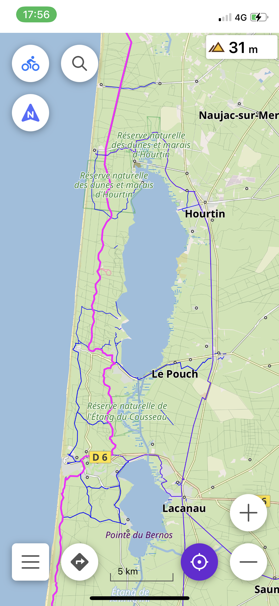
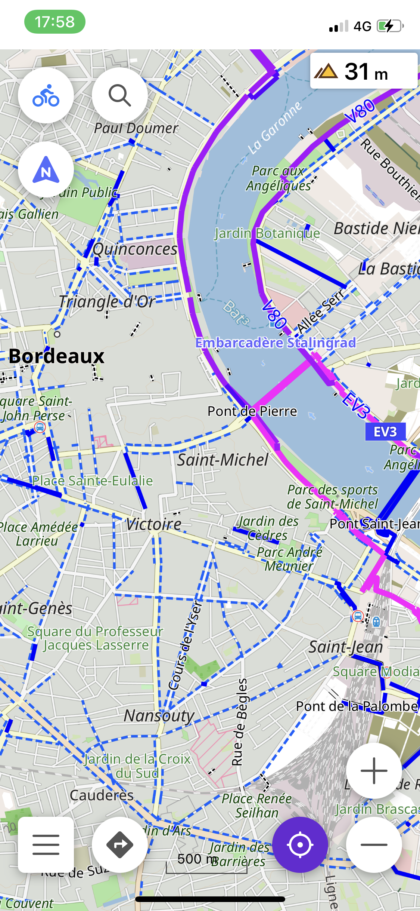
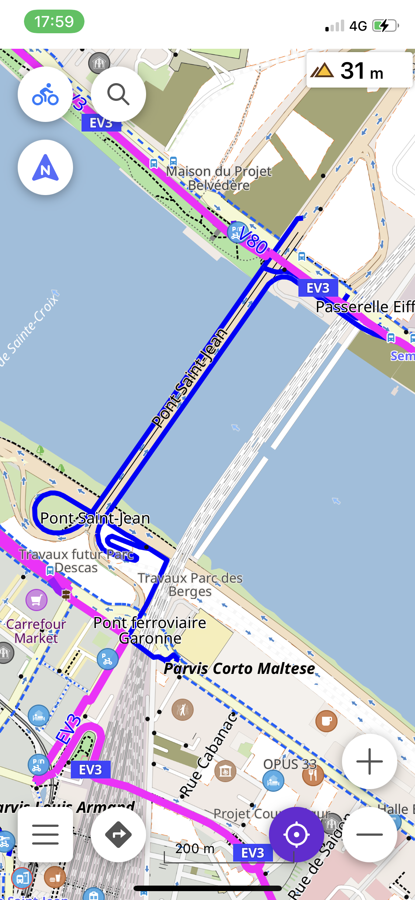
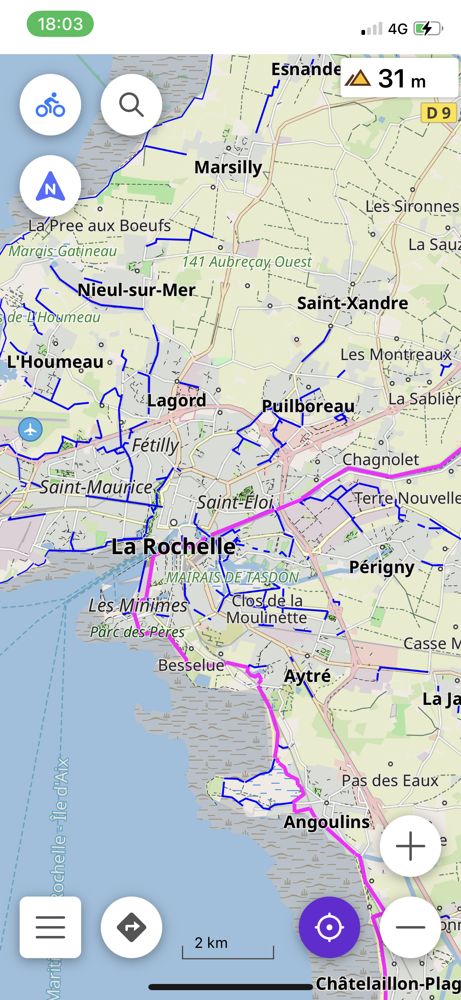
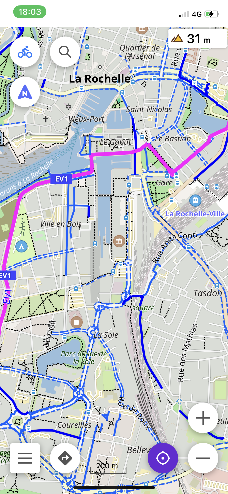

# OsmAnd_Cycling_Map
Estilo para ciclismo y cicloturismo en la aplicación Osmand

- 🇪🇸 **[Español](README_ES.md)** 
🇬🇧 [Inglés](README_EN.md) 
🇫🇷 [Francés](README.md)

 

## Cambios notables respecto al estilo estándar:
 

- Carriles y rutas para bici más legibles y visibles.
- PDI útiles/interesantes resaltados
- Color del suelo y usos del agua
- Color opaco para las rutas
- Ajuste adicional para el cicloturismo
- Ajuste adicional para ocultar los símbolos de los usos del suelo
- Y más todavía ; ) 
    

  
  

  
  
  
  
  
  

## Instalar rl estilo
Funciona en Android y iOS.

- Descarga el archivo [CycloRoute.render.xml](https://raw.githubusercontent.com/Hades1503/OsmAnd_Cycling_Map/main/CycloRoute.render.xml)
  - **Desde un ordenador** : Click derecho en [este enlace](https://github.com/Hades1503/OsmAnd_Cycling_Map/raw/main/CycloRoute.render.xml) → <kbd><samp>Guardar enlace como...</samp></kbd>.
  - **Desde un smartphone** : Mantén presionado [este enlace](https://github.com/Hades1503/OsmAnd_Cycling_Map/raw/main/CycloRoute.render.xml) → <kbd><samp>Descargar enlace</samp></kbd>. 
     
    *Tutorial hecho con el navegador <a href="https://www.mozilla.org/es-ES/firefox/new/">Firefox</a> – los términos pueden ser diferentes al usar otro navegador.* 
     
- Abrir el archivo descargado, y elegir `Abrir con OsmAnd`. El estilo ha sido importado!
- Abrir OsmAnd, luego en el menu de la izquierda pulsar `Configurar mapa`
- Bajar hasta `Estilo del mapa` y pulsar
- Seleccionar `CycloRoute`, tu nuevo estilo.
- Terminado, a disfrutar! 🎉
 

    
<i>Android ; Método alternativo</i>

        
Una vez descargado el archivo, moverlo a la carpeta Android → Data → net.osmand.plus → files → rendering.

   

## Configurar el mapa para el ciclismo

### Para aprovechar al máximo este estilo para el CICLISMO, proceder como se explica a continuación:

  - Ir a configurar mapa
    - Pulsar "Ocultar"
      - Ocultar iconos de PDI
      - Ocultar etiquetas de PDI

*La pantalla mostrará sólo los PDI útiles para la bici*
  

## Configurar el mapa para el cicloturismo

### Para aprovechar al máximo este estilo para el CICLOTURISMO, proceder como se explica a continuación:

  - Ir a configurar mapa
    - Pulsar "Ocultar"
      - Ocultar iconos de PDI
      - Ocultar etiquetas de PDI

**Luego**

  - Ir a configurar mapa
    - Pulsar "Detalles"
      - Activar POI for Cyclotouring

*La pantalla mostrará los PDI que sean útiles para el cicloturismo, además de los del ciclismo.*
